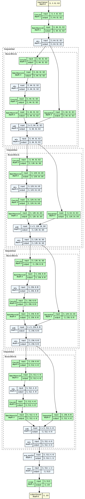

# DL_MiniProject
The goal is to come up with a modified ResNet18 architecture with the highest test accuracy on the CIFAR10 image classification dataset, under the constraint that it has no more than 5 million parameters.

## Model and dataset used:
* ResNet-18
* CIFAR10 dataset

## How to use:
* Can be easily runned by Google Colab

## ResNet18 Ver result
* Best Acc is 88 after 25 epoch
* Best Acc is 90 after 35 epoch

## Model Arichitecture

